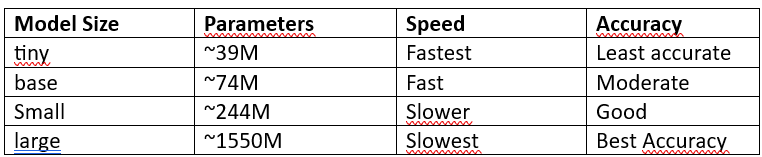

# Project Idea 

Use whisper openai opensource model for speech to text translation or transcription. This is hosted through a flask application, where the user is asked to choose a file which will be an mp3 recording and input the task he wants to perform. 

# Whisper architecture overview

Whisper is an open-source ASR (automatic speech recognition) model developed by OpenAI. It can transcribe audio into text and even translate multiple languages into Englis. It's trained on a massive and diverse dataset of multilingual and multitask supervised data.

1. Whisper Architecture : 
Whisper is similar to sequence to sequence model very much similar to T5. It follows transformer architecture where it starts with convolutional layer to extract features from the log mel spectograms after the data collection (recording.mp3). Then the decoder will generate next tokens in the target language and also based on the task whether to transcribe or to translate. The output format will be human readable text that the decoder has outputed as token using a GPT like Tokenizer. 

Whisper is a non autoregressive encoder (as it takes the input at one time and extract the audio features, the semantic between the different tokens .. ) and causal decoder (as it is autoregressive and the next token depnds from the previous generated token)

2. Whisper Training Strategy: 

* Trained on 680K hours of labeled audio data scraped from the web (not a very clean data such as libri speech but a lot of filtering pipeline were added to filter out pairs of audi-speech that were misleading or contain a lot opf error refer to whisper openai paper)

* Althrought there were noisy data, but it helped with the model generalization comparing clen data ASR

* Multitask: trained on ASR, language detection, voice activity detection and translation. 

3. Model Variants: 

4. Limitations 

* Not Real time : it's fast but not designed for live transcription (we can batch audio into short segments though) 
* No speaker diarization: it fails to distinguish between different speakers 
* Only translates to english 

==> for the sake of testing, we will add BART from hugging face hub for multiple text translation and include it in the solution 

==> we can also perform from speech to image 

==> We need to work on prompting so that we allow the user add any input and the model will perform the related task 

